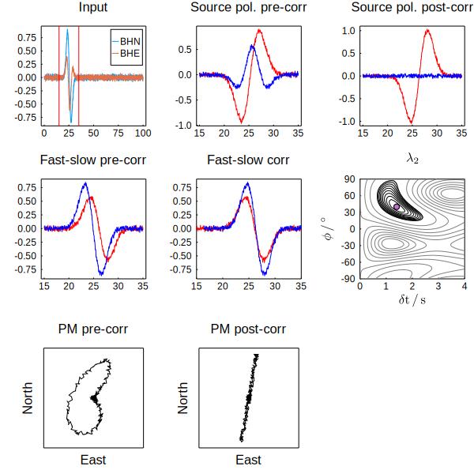

# SeisSplit

SeisSplit is a package for measuring shear wave splitting using the
minimum eigenvalue method of Silver & Chan (1991), as modified by
Walsh et al. (2013).

It uses the [Seis.jl](https://github.com/anowacki/Seis.jl) package which
is an in-development community seismic analysis package in Julia.

## Installing

```julia
julia> ] # Press ']' to get to package mode

(v1.1)> add https://github.com/anowacki/Geodesics.jl https://github.com/anowacki/SAC.jl https://github.com/anowacki/Seis.jl https://github.com/anowacki/SeisSplit.jl
```

## Using

The `splitting` function performs shear wave splitting analysis and returns a `SeisSplit.Result`
type containing information about the analysis.  Provide two `Seis.Trace`s, and
optionally specify the maximum delay time and number of fast orientation and delay
time analysis points.

Example:

```julia-repl
julia> using Seis, SeisSplit

julia> n, e = Seis.read_sac.(joinpath(dirname(pathof(SeisSplit)), "..", "test", "data", "wave.BH").*("N", "E"))
(Seis.Trace(.SWAV..BHN: delta=0.05, b=0.0, nsamples=1999), Seis.Trace(.SWAV..BHE: delta=0.05, b=0.0, nsamples=1999))

julia> s = splitting(n, e)
SeisSplit.Result{Float32,Array{Float32,1}}(-90.0:1.0:90.0, 0.0:0.10256410256410256:4.0, Float32[69.407 70.6024 … 64.1079 64.2652; 69.407 70.5508 … 64.6298 64.767; … ; 69.407 70.6525 … 63.5645 63.7426; 69.407 70.6024 … 64.1079 64.2652], Float32[8.79587 8.05464 … 12.038 11.9395; 8.79587 8.08652 … 11.7154 11.6291; … ; 8.79587 8.02363 … 12.3742 12.2627; 8.79587 8.05464 … 12.038 11.9395], 41.0, 0.5, 1.3333333333333333, 0.0, 10.455532f0, 1.1246407f0, Seis.Trace(.SWAV..BHN: delta=0.05, b=0.0, nsamples=1999), Seis.Trace(.SWAV..BHE: delta=0.05, b=0.0, nsamples=1999), 0.0f0, 99.9f0)

```

The following is the docstring for the `splitting` function:

```
    splitting(t1, t2, window_start=starttime(t1), window_end=endtime(t1); nphi=181, ndt=40, dt_max=4.0) -> results

Perform a search over a pair of `Seis` traces, `t1` and `t2`, for the smallest value of the
minimum eigenvalue of the covariance matrix between the traces, for a set of `nphi`×`ndt`
shear wave splitting operators, up to `dt_max` s.

`results` is a `SeisSplit.Result` containing:

- `phi`: The set of fast shear wave orientations in °
- `dt`: The set of delays times in s
- `lam1`: The larger eigenvalues at each [phi,dt] point
- `lam2`: The smaller eigenvalues at each point
- `phi_best` and `dphi`: The best ϕ and its 1σ uncertainty. ϕ is measured
    clockwise from local north (towards east) in °.
- `dt_best` and `ddt`: The best δt and its 1σ uncertainty, in s
- `spol` and `dspol`: The source polarisation and an estimate of its uncertainty
    for the best-fitting ϕ and δt. `spol` is given in ° clockwise of local north.
- `trace1` and `trace2`, the original input traces, where `trace2` is clockwise of
    `trace1`
-  `window_start`, `window_end`, the analysis time window end points.

```

### Plotting results

You can create a diagnostic plot of a `SeisSplit.Result` by loading
[`Plots.jl`](https://github.com/JuliaPlots/Plots.jl) and calling `plot()` on the result:

```julia-repl
julia> using Plots

julia> plot(s)
```




## References

- Silver, P.G., Chan, W.W., 1991. Shear-wave splitting and subcontinental mantle
  deformation. J Geophys Res-Sol Ea 96, 16429–16454.
  doi:[10.1029/91JB00899](https://doi.org/10.1029/91JB00899)
- Walsh, E., Arnold, R., Savage, M.K., 2013. Silver and Chan revisited.
  Journal of Geophysical Research: Solid Earth 118, 5500–5515.
  doi:[10.1002/jgrb.50386](https://doi.org/10.1002/jgrb.50386)
